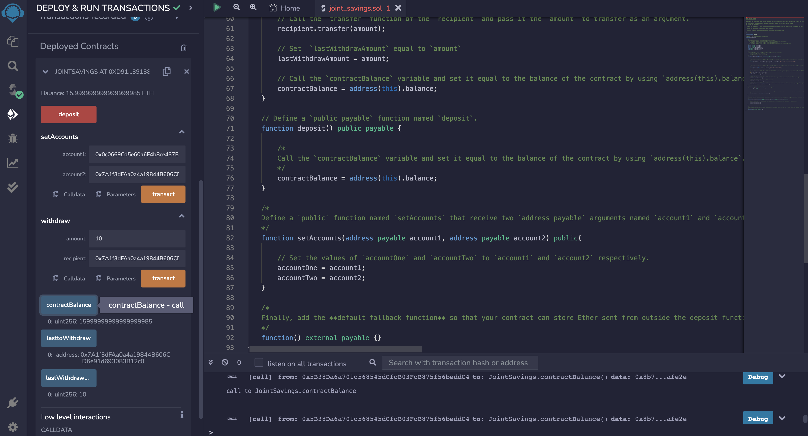

# Ethereum Joint Savings Smart Contract

This repository showcases a Solidity smart contract that powers a collaborative joint savings account. The contract facilitates secure and transparent shared savings management using Ethereum blockchain technology.

**Last Updated:** 2023-08-01

---

## Technologies Used

- **Programming Language:** Solidity
- **Libraries:** Web3.py, Streamlit, DataClasses, Typing

---

## Setup Instructions

1. **Install Dependencies**: Make sure you have Python and the required libraries installed, including Streamlit and Web3.py.

2. **Clone Repository**: Clone this repository to your local machine using the following command:

   ```shell
   git clone <repository link>
   ```

3. **Navigate to Repository**: Change your directory to the cloned repository:

   ```shell
   cd <repository name>
   ```

---

## Usage

To experience the Ethereum-powered joint savings account, follow these steps:

1. **Run Application**: Activate the 'dev' environment and execute the Streamlit application:

   ```shell
   conda activate dev
   streamlit run fintech_finder.py
   ```

2. **Interact**: Follow on-screen instructions to explore the collaborative savings functionality. Generate Ethereum accounts, check balances, and execute payments.

Ensure you have Python and required libraries installed, and the file "fintech_finder.py" is present.

---

## Screenshots



---

## References

- [Streamlit Documentation](https://docs.streamlit.io/library/)
- [Web3.py Documentation](https://web3py.readthedocs.io/en/stable/)
- [Ganache](https://www.trufflesuite.com/ganache)

---

## Summary

The Ethereum Joint Savings Smart Contract revolutionizes collaborative savings using blockchain. It lets users save together securely. Built with Solidity and Web3.py, it's a glimpse into the future of decentralized finance. Run the Streamlit app, explore, and embrace the future of finance.

---

**Contributor:**
Rosalinda Olvera Fernandez
- [GitHub](https://github.com/rolvera05)
- Email: rolvera98271@gmail.com